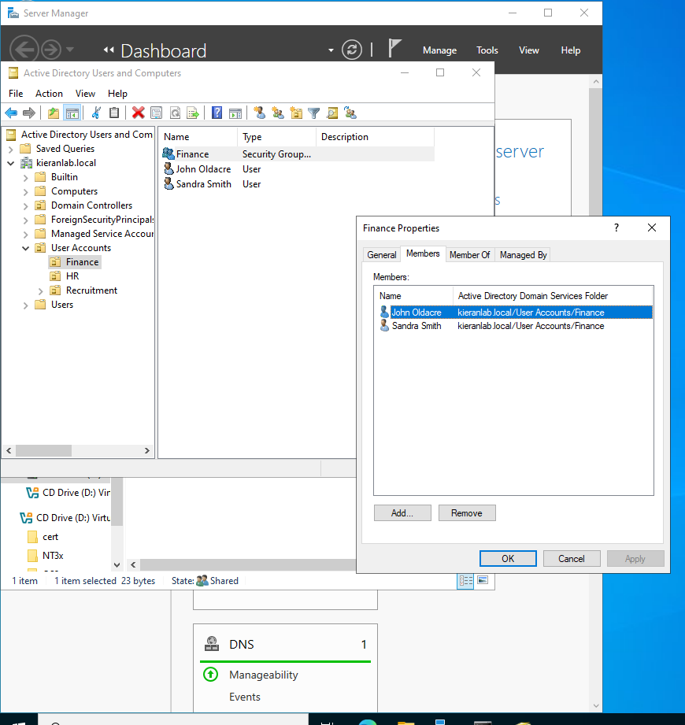
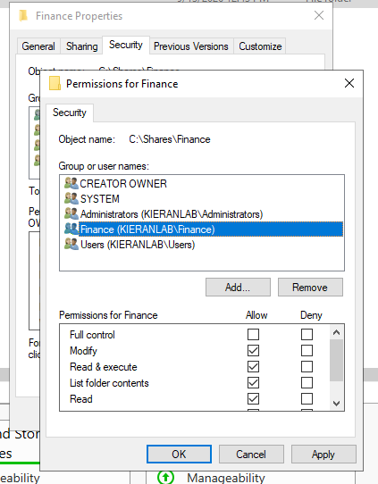
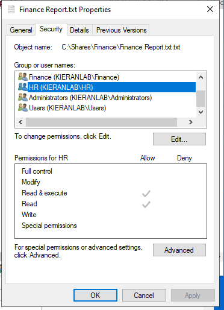
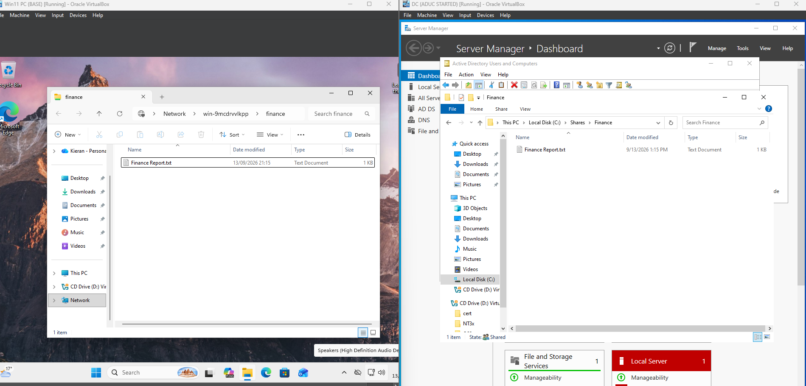
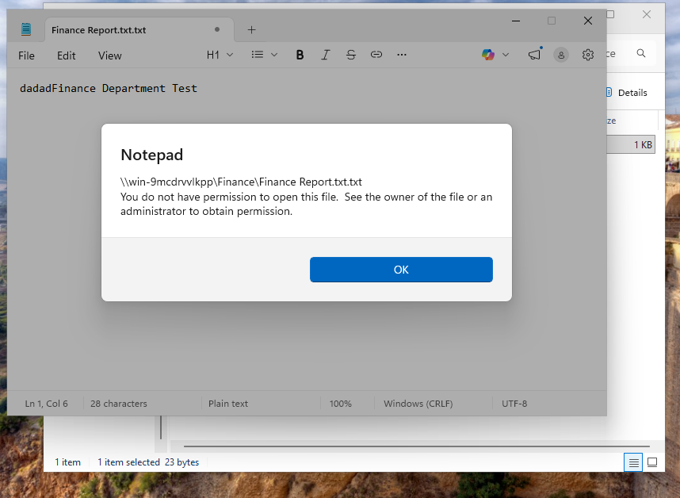

# Active Directory File Share & NTFS Permissions

## Overview

This project demonstrates how Active Directory security groups and NTFS permissions can be used to control access to a shared departmental folder.

A **Finance** folder was hosted on a Windows Server and shared across the network using SMB. Access was then controlled based on Active Directory group membership.

The scenario was configured so that:

- **Finance users** have Modify access to the Finance folder.
- **HR users** have read-only access to the Finance folder.

The configuration was then tested from a Windows 11 domain client to confirm that the permissions were being enforced correctly.

---

## Active Directory Security Groups

Users were organised into departmental OUs within Active Directory and added to security groups based on their department.

Rather than assigning permissions directly to individual user accounts, access to the Finance folder was assigned to these security groups.

For example, **John Oldacre** and **Sandra Smith** are members of the Finance security group:

Using security groups makes permissions easier to manage. If another employee joins Finance, they can be added to the Finance security group rather than having permissions manually configured against their individual account.

---

## Finance Network Share

The Finance folder was created on the server at:

`C:\Shares\Finance`

The folder was then shared over the network using SMB and could be accessed from the Windows 11 client using the server's UNC path:

`\\win-9mcdrvvlkpp\Finance`

Share permissions allow authenticated users to connect to the resource, while NTFS permissions are used to provide more granular control over what each department can do with the files.

---

## Finance Permissions

The **Finance** Active Directory security group was granted **Modify** NTFS permissions on the Finance folder.

Modify permission allows Finance users to:

- Open and read files
- Create new files and folders
- Edit and save existing files
- Rename files
- Delete files and folders

Full Control was not required because standard Finance users do not need the ability to change permissions or take ownership of the folder.

---

## HR Permissions

The **HR** security group was given **Read & Execute** access.

This allows HR users to access and read files within the Finance share without being able to modify the information stored there.

The permissions inherited by the test Finance report show that HR has **Read & Execute** and **Read**, but does not have **Modify** or **Write**.

This provides access to information that HR may need to reference while protecting the files from unauthorised modification.

---

## Testing the Network Share

The configuration was tested from a separate Windows 11 client.

A Finance user accessed the Finance folder across the network and created `Finance Report.txt`. The same file can be seen from both the client network share and the physical `C:\Shares\Finance` location on the Windows Server.

This confirms that the client is accessing the server-hosted SMB share rather than working with a locally stored copy.

The Finance account was able to create, edit and save files because its Finance security group had **Modify** permission.

---

## Testing HR Read-Only Access

The same network share was then accessed using an account belonging to the HR security group.

The HR user could successfully browse the Finance folder and open `Finance Report.txt`. However, when changes were made and the user attempted to save them back to the shared file, Windows prevented the operation.

This confirms that the NTFS permissions were being enforced correctly:

| Security Group | Read | Create/Edit | Delete | Result |
|---|---|---|---|---|
| Finance | Yes | Yes | Yes | Modify access |
| HR | Yes | No | No | Read-only access |

Both departments can therefore access the same network resource while receiving different levels of access based on their Active Directory security group membership.

---

## Share Permissions vs NTFS Permissions

Windows file shares can use two permission layers:

| Permission Type | Purpose |
|---|---|
| **Share permissions** | Control access when a folder is accessed across the network |
| **NTFS permissions** | Control what users and groups can do with files and folders |
| **Effective access** | Determined by the combination of applicable Share and NTFS permissions |

In this lab, the share permissions allowed authenticated users to access the network share, while NTFS permissions provided the more granular departmental restrictions.

This resulted in Finance users receiving Modify access while HR users remained read-only.

---
- Testing permissions from an end-user workstation
- Troubleshooting network resource access

The lab demonstrates how access to shared organisational resources can be managed centrally through Active Directory rather than assigning permissions individually to each user.
